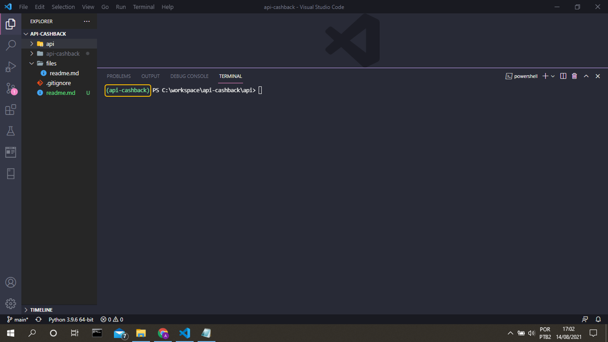
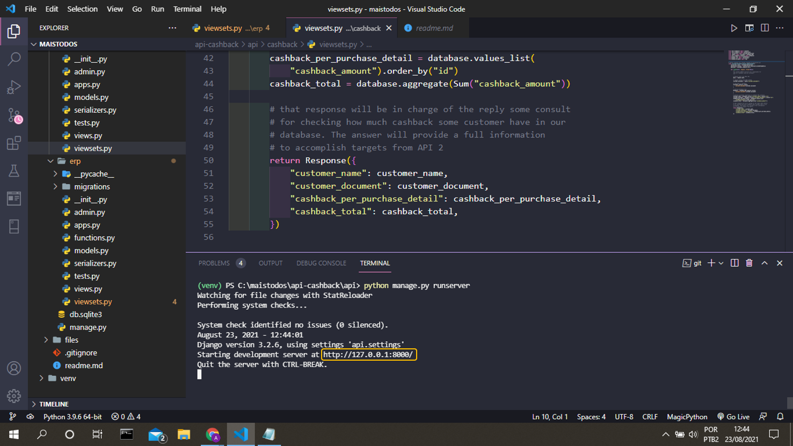
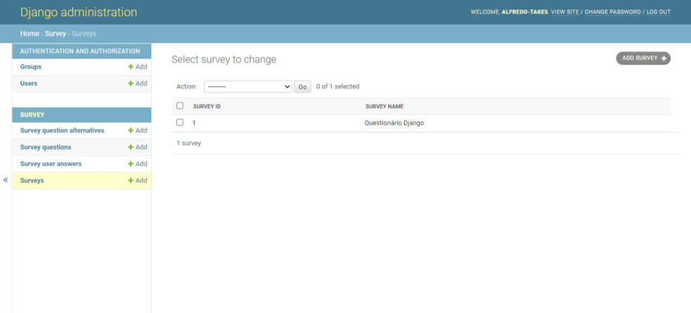
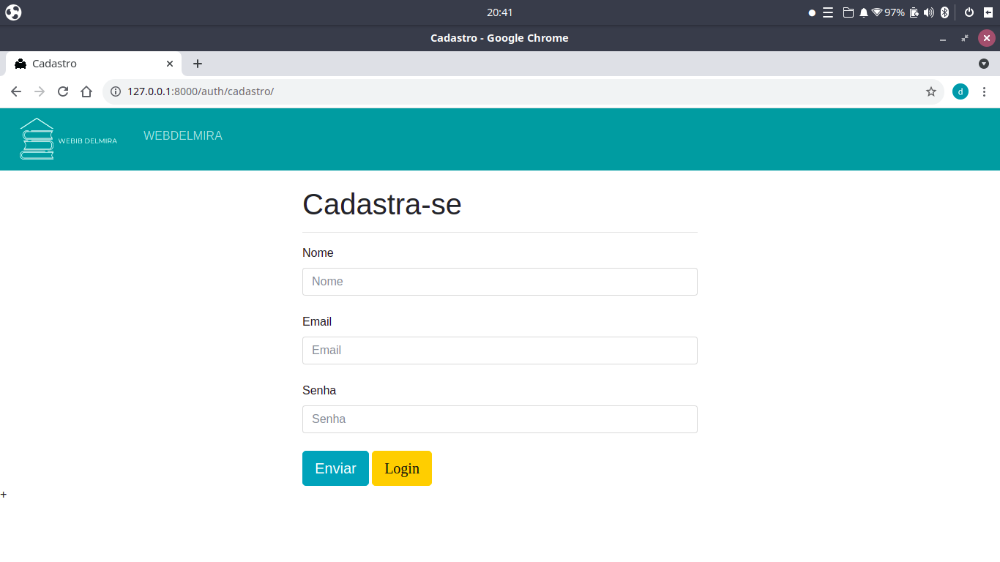
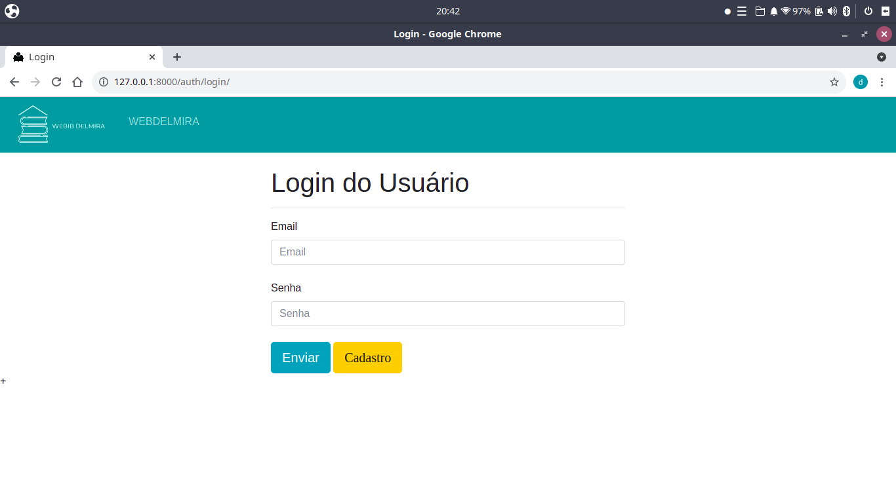
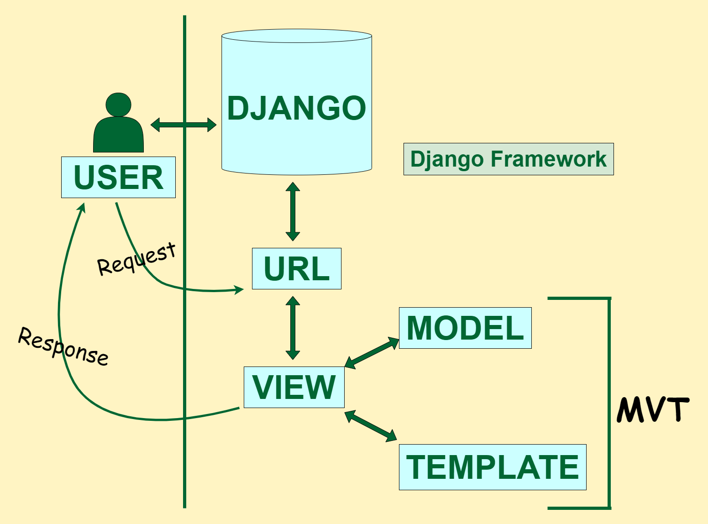
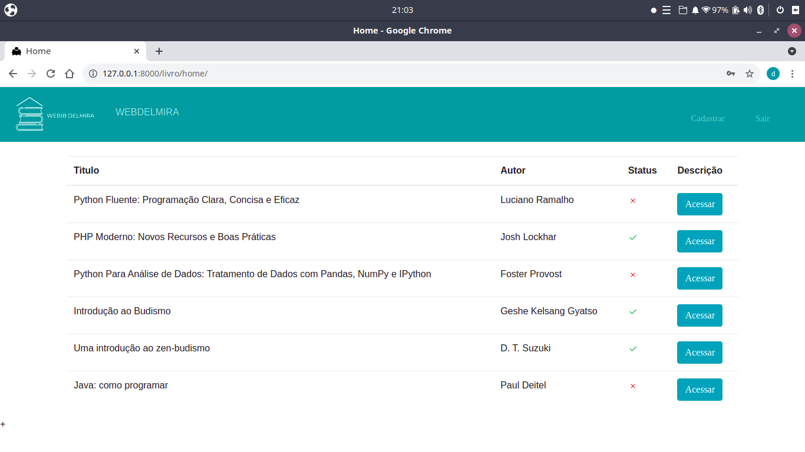

# Django - Passo a Passo

## 1° Ambiente Virtual

Sempre quando iniciar um projeto, devemos isolar esse ambiente de desenvolvimento do nosso equipamento (computador). Isso ajuda a manter a estabilidade do sistema e evitar conflito de versões de bibliotecas. 

Exemplo: Na sua máquina você utiliza o Python versão 2.7. Mas, no projeto da biblioteca, vamos utilizar o Python na última versão 3.9.5. O ambiente evita esses tipos de conflitos.

Criando um ambiente virtual:

~~~cmd
python -m venv library
~~~

Descrevendo o comando:

1. python -m venv -> O comando python para criar um ambiente virtual.
2. library -> O nome do ambiente virtual. 

Ativando o ambiente virtual:

~~~cmd
library/Scripts/Activate
~~~

A palavra library vai aparecer na frente da sua linha de comando entre-parenteses. conforme exemplo abaixo:

## 2° Instalando o Django e o PostgreSQL

Para instalar o Django e o PostgreSQL usaremos os seguintes códigos no terminal do Windows: 

~~~cmd
pip install django
~~~

Para rodar Postgres rodar com o Django vamos precisar de um driver também, chamado psycopg2.

~~~cmd
pip install psycopg2
~~~

## 3° Iniciando o projeto Django

Com o ambiente virtual inciado e as depedências instaladas, vamos inciar o nosso projeto. 

~~~cmd
django-admin startproject myproject
~~~

Vamos verificar se o Django está funcionando corretamente. 

~~~cmd
python manage.py runserver
~~~

O código acima irá iniciar o servidor localhost do Django, conforme imagem abaixo:

## 4° Configurando o PostgreSQL no Django

Como o Django por padrão vem setado para o SQLite temos que alterar as configs para o PostgreSQL.
Proseguindo, abra o arquivo settings.py e deixe a constante DATABASES deste jeito:

~~~python
DATABASES = {
    'default': {
        'ENGINE': 'django.db.backends.postgresql_psycopg2',
        'NAME': 'postgres',
        'USER': 'root',
        'PASSWORD': 'Den.11101',
        'HOST': 'db',
        'PORT': 5432,
    }
}
~~~

## 5° Criando o Super User

Com o comando abaixo criaremos nosso usuário para usar a área administrativa:

~~~cmd
python manage.py createsuperuser
~~~

nome: univesp
senha: univesp2021

Digite seu usário e senha e não se esqueça destas credenciais, vamos utilizar mais adiante

## 6° Migrações Padrões do Django e "Hello World!"

O Django vem com um admin pronto e uma estrutura de usuários e hierarquia, basta rodar o comando abaixo para fazer todas as migrações:

~~~cmd
python manage.py migrate
python manage.py makemigrations
~~~

## 7° Acessando o painel administrativo do Django

Acessando o painel admin do Django: 

~~~cmd
python manage.py runserver
~~~

1. Clica no link de Localhost
2. Vai até a URL do Google Chrome que abriu e digite o seguinte endereço: <b>http://127.0.0.1:8000/admin</b>
3. Insira o usuário e a senha definido no passo 5.

A imagem abaixo é um exemplo do painel administrativo do Django:

## 8° Fazendo a migração do banco legado no Django

O banco de dados foi elaborado pelo time de DBMS (Data Base Management System). O script abaixo é o código SQL: 

~~~sql
CREATE TABLE tb_usuario (
	usu_id serial NOT NULL,
	usu_nome TEXT NOT NULL,
	usu_nome_completo TEXT NOT NULL,
	usu_email TEXT NOT NULL,
	usu_tipo TEXT NULL,
    usu_senha TEXT NOT NULL,
    usu_ativo BOOLEAN NOT NULL DEFAULT FALSE,
    usu_dtcastro TIMESTAMP NOT NULL,
    CONSTRAINT tb_usuario_usu_id_pk PRIMARY KEY (usu_id)
    );

CREATE TABLE tb_funcionario (
	fun_id serial NOT NULL,
	fun_nome TEXT NOT NULL,
	fun_cargo TEXT NOT NULL,
	fun_email TEXT NOT NULL,
	fun_usu_id INT4 NOT NULL, 
    fun_dtcastro TIMESTAMP NOT NULL, 
    fun_ativo BOOLEAN NOT NULL DEFAULT FALSE,
    CONSTRAINT tb_funcionaio_fun_id_pk PRIMARY KEY (fun_id),
    CONSTRAINT tb_funcionaio_fun_usu_id_fk FOREIGN KEY (fun_usu_id) REFERENCES tb_usuario(usu_id)
);
CREATE TABLE tb_aluno (
	alu_id serial NOT NULL,
	alu_nome TEXT NOT NULL,
	alu_ra INT4 NOT NULL,
	alu_email TEXT NULL,
	alu_usu_id INT4 NULL, 
    alu_dtcastro TIMESTAMP NOT NULL, 
    alu_ativo BOOLEAN NOT NULL DEFAULT FALSE,
    CONSTRAINT pk_tb_aluno_alu_id_pk PRIMARY KEY (alu_id),
    CONSTRAINT tb_aluno_alu_usu_id_fk FOREIGN KEY (alu_usu_id) REFERENCES tb_usuario (usu_id)
);

CREATE TABLE tb_parteleira (
	par_id serial NOT NULL,
	par_rua TEXT NULL,	
	par_altura TEXT NULL,
	par_largura TEXT NULL,
	par_descricao TEXT NULL,
	par_usu_cadastro INT4  NULL, 
    par_dtcastro TIMESTAMP NOT NULL, 
    par_ativo BOOLEAN NOT NULL DEFAULT FALSE,
    CONSTRAINT tb_parteleira_par_id_pk PRIMARY KEY (par_id)
);

CREATE TABLE tb_genero (
	gen_id serial NOT NULL,
	gen_descricao TEXT NULL,
    CONSTRAINT tb_genero_gen_id_pk PRIMARY KEY (gen_id)
);

CREATE TABLE tb_doacao (
	doa_id serial NOT NULL,
	doa_descricao TEXT NULL,
	doa_doador TEXT NOT NULL,
	doa_dt TIMESTAMP NOT NULL ,
    CONSTRAINT tb_doacao_doa_id_pk PRIMARY KEY (doa_id)
);

CREATE TABLE tb_doacao_item (
	doi_id serial NOT NULL,
	doi_doa_id INT4 NULL,
	doi_titulo TEXT NULL,
	doi_gen_id TEXT NOT NULL,
	doi_qnt INT4 NULL,
    CONSTRAINT tb_doacao_item_doi_id_pk PRIMARY KEY (doi_id),
    CONSTRAINT tb_doacao_item_doi_doa_id_fk FOREIGN KEY (doi_doa_id) REFERENCES tb_doacao (doa_id)
);
CREATE TABLE tb_livro (
	lvr_id serial NOT NULL,
	lvr_titulo TEXT NULL,
	lvr_gen_id INT4 NULL,	
	lvr_autor TEXT NULL,
	lvr_qnt TEXT NULL,
	lvr_partimonio INT4 NULL,
	lvr_doacao INT4  NULL, 
    lvr_dtcastro TIMESTAMP NOT NULL , 
    lvr_par_id INT4 NOT NULL,
    lvr_part_local TEXT NULL,
    lvr_ativo BOOLEAN NOT NULL DEFAULT FALSE,
    CONSTRAINT tb_livro_lvr_id_pk PRIMARY KEY (lvr_id),
    CONSTRAINT tb_livro_lvr_gen_id_fk FOREIGN KEY (lvr_gen_id) REFERENCES tb_genero(gen_id),
    CONSTRAINT tb_livro_lvr_par_id_fk FOREIGN KEY (lvr_par_id) REFERENCES tb_parteleira(par_id)
);

CREATE TABLE tb_emprestimo (
	emp_id serial NOT NULL,
	emp_lvr_id INT4 NOT NULL,
	emp_alu_id INT4 NULL,
	emp_fun_id INT4 NULL,
	emp_dt_prevdev DATE NOT NULL,
	emp_dt_dev TIMESTAMP NOT NULL,	
	emp_qnt INT4 NULL,
	emp_dt TIMESTAMP NOT NULL,
	emp_usu_cad INT4 NOT NULL,
	emp_status VARCHAR(1) NULL,
    CONSTRAINT tb_emprestimo_emp_id_pk PRIMARY KEY (emp_id),
    CONSTRAINT tb_emprestimo_emp_lvr_id_fk FOREIGN KEY (emp_lvr_id) REFERENCES tb_livro (lvr_id),
    CONSTRAINT tb_emprestimo_emp_alu_id_fk FOREIGN KEY (emp_alu_id) REFERENCES tb_aluno (alu_id),
    CONSTRAINT tb_emprestimo_emp_fun_id_fk FOREIGN KEY (emp_fun_id) REFERENCES tb_funcionario (fun_id)
);
~~~

O Django possui o comando inspect db, que tem como função verificar o banco de dados configurado no arquivo settings.py e fazer as migrações com o código python na aplicação controle. O comando abaixo tem como esse objetivo: 

~~~cmd
python manage.py inspectdb > models.py
~~~

Após a execução do comando acima, o seguinte código será salvo no arquivo models.py da aplicação controle: 

~~~python
# This is an auto-generated Django model module.
# You'll have to do the following manually to clean this up:
#   * Rearrange models' order
#   * Make sure each model has one field with primary_key=True
#   * Make sure each ForeignKey and OneToOneField has `on_delete` set to the desired behavior
#   * Remove `managed = False` lines if you wish to allow Django to create, modify, and delete the table
# Feel free to rename the models, but don't rename db_table values or field names.
from django.db import models

class TbAluno(models.Model):
    alu_id = models.AutoField(primary_key=True)
    alu_nome = models.TextField()
    alu_ra = models.IntegerField()
    alu_email = models.TextField(blank=True, null=True)
    alu_usu = models.ForeignKey('TbUsuario', models.DO_NOTHING, blank=True, null=True)
    alu_dtcastro = models.DateTimeField()
    alu_ativo = models.BooleanField()

    class Meta:
        managed = False
        db_table = 'tb_aluno'

class TbDoacao(models.Model):
    doa_id = models.AutoField(primary_key=True)
    doa_descricao = models.TextField(blank=True, null=True)
    doa_doador = models.TextField()
    doa_dt = models.DateTimeField()

    class Meta:
        managed = False
        db_table = 'tb_doacao'

class TbDoacaoItem(models.Model):
    doi_id = models.AutoField(primary_key=True)
    doi_doa = models.ForeignKey(TbDoacao, models.DO_NOTHING, blank=True, null=True)
    doi_titulo = models.TextField(blank=True, null=True)
    doi_gen_id = models.TextField()
    doi_qnt = models.IntegerField(blank=True, null=True)

    class Meta:
        managed = False
        db_table = 'tb_doacao_item'

class TbEmprestimo(models.Model):
    emp_id = models.AutoField(primary_key=True)
    emp_lvr = models.ForeignKey('TbLivro', models.DO_NOTHING)
    emp_alu = models.ForeignKey(TbAluno, models.DO_NOTHING, blank=True, null=True)
    emp_fun = models.ForeignKey('TbFuncionario', models.DO_NOTHING, blank=True, null=True)
    emp_dt_prevdev = models.DateField()
    emp_dt_dev = models.DateTimeField()
    emp_qnt = models.IntegerField(blank=True, null=True)
    emp_dt = models.DateTimeField()
    emp_usu_cad = models.IntegerField()
    emp_status = models.CharField(max_length=1, blank=True, null=True)

    class Meta:
        managed = False
        db_table = 'tb_emprestimo'

class TbFuncionario(models.Model):
    fun_id = models.AutoField(primary_key=True)
    fun_nome = models.TextField()
    fun_cargo = models.TextField()
    fun_email = models.TextField()
    fun_usu = models.ForeignKey('TbUsuario', models.DO_NOTHING)
    fun_dtcastro = models.DateTimeField()
    fun_ativo = models.BooleanField()

    class Meta:
        managed = False
        db_table = 'tb_funcionario'

class TbGenero(models.Model):
    gen_id = models.AutoField(primary_key=True)
    gen_descricao = models.TextField(blank=True, null=True)

    class Meta:
        managed = False
        db_table = 'tb_genero'

class TbLivro(models.Model):
    lvr_id = models.AutoField(primary_key=True)
    lvr_titulo = models.TextField(blank=True, null=True)
    lvr_gen = models.ForeignKey(TbGenero, models.DO_NOTHING, blank=True, null=True)
    lvr_autor = models.TextField(blank=True, null=True)
    lvr_qnt = models.TextField(blank=True, null=True)
    lvr_partimonio = models.IntegerField(blank=True, null=True)
    lvr_doacao = models.IntegerField(blank=True, null=True)
    lvr_dtcastro = models.DateTimeField()
    lvr_par = models.ForeignKey('TbParteleira', models.DO_NOTHING)
    lvr_part_local = models.TextField(blank=True, null=True)
    lvr_ativo = models.BooleanField()

    class Meta:
        managed = False
        db_table = 'tb_livro'

class TbParteleira(models.Model):
    par_id = models.AutoField(primary_key=True)
    par_rua = models.TextField(blank=True, null=True)
    par_altura = models.TextField(blank=True, null=True)
    par_largura = models.TextField(blank=True, null=True)
    par_descricao = models.TextField(blank=True, null=True)
    par_usu_cadastro = models.IntegerField(blank=True, null=True)
    par_dtcastro = models.DateTimeField()
    par_ativo = models.BooleanField()

    class Meta:
        managed = False
        db_table = 'tb_parteleira'

class TbUsuario(models.Model):
    usu_id = models.AutoField(primary_key=True)
    usu_nome = models.TextField()
    usu_nome_completo = models.TextField()
    usu_email = models.TextField()
    usu_tipo = models.TextField(blank=True, null=True)
    usu_senha = models.TextField()
    usu_ativo = models.BooleanField()
    usu_dtcastro = models.DateTimeField()

    class Meta:
        managed = False
        db_table = 'tb_usuario'
~~~

Após as configurações do banco de dados e o arquivo models.py, o Django necessita das migrações do banco de dados.

~~~cmd
python manage.py migrate
python manage.py makemigrations
~~~

## 9° Configurando a view da tela inicial

O sistema web possui tela inicial que compoe o cadastro e login, a tela principal onde é listado todos os livros da biblioteca, tela de detalhe de cada livro onde é possivél verificar informações adicionais do livro e histórico de emprestimo e a tela de cadastro de emprestimo, livros e categorias.

Todo a lógico do sistema é construido no arquivo views.py de cada aplicação Django. Dessa forma o Django permiter isolar e segregar cadas lógica em determinado uri. 

Os seguintes passos descreve como cadastrar a tela inicial:

1. Configuração do arquivo urls.py do projeto webib:

~~~python
from django.contrib import admin
from django.urls import path, include

urlpatterns = [
    path('admin/', admin.site.urls),
    path('livro/', include('livro.urls')),
    path('auth/', include('usuarios.urls')),
]
~~~

no código: 
~~~python
    ...
    path('auth/', include('usuarios.urls')),
    ...
~~~

Está sendo a configuração da rota `auth/` e direcionando para a aplicação `usuarios`. 

2. Configuração do arquivo urls.py da aplicação usuários:

~~~python
from django.urls import path
from . import views

urlpatterns = [
    path('login/', views.login, name='login'),
    path('cadastro/', views.cadastro, name='cadastro'),
    path('valida_cadastro/', views.valida_cadastro, name='valida_cadastro'),
    path('validar_login/', views.validar_login, name='validar_login'),
    path('sair/', views.sair, name='sair'),
]
~~~

no código: 
~~~python
    ...
    path('cadastro/', views.cadastro, name='cadastro'),
    ...
~~~

Está sendo configurado um complemento da uri de cadastro. No caso a url inteira será `auth/cadastro/`. 
A lógica que estará no backend dessa url completa, será descrita no arquivo views.py da aplicação usuários. A função para acessar o código é cadastro, que está descrito na viaravel `views.cadastro`.

3. Configuração do arquivo views.py da aplicação usuários:

~~~python
from hashlib import sha256

from django.http import HttpResponse
from django.shortcuts import redirect, render

from .models import Usuarios

...

def cadastro(request):
    if request.session.get('usuario'):
        return redirect('/livro/home/')
    
    status = request.GET.get('status')
    return render(request, 'cadastro.html', {'status': status})

...
~~~

Na função cadastro recebe um request, que é um variavél que está no navegador que indica uma ação do usuário. O bloco `if` verifica se o usário está logado, caso positivo, a url irá redirecionar o usário para a tela de home. 

Caso contrário o usuário será redirecionado para a tela de cadastro, que possui as funções de cadastro e login do usuário.

Todas essas situações problema são configuradas no arquivo views.py na função valida_cadastro. 

~~~python
def valida_cadastro(request):
    nome = request.POST.get('nome')
    senha = request.POST.get('senha')
    email = request.POST.get('email')

    usuario = Usuarios.objects.filter(email = email)

    if len(nome.strip()) == 0 or len(email.strip()) == 0:
        return redirect('/auth/cadastro/?status=1')

    if len(senha) < 8:
        return redirect('/auth/cadastro/?status=2')

    if len(usuario) > 0:
        return redirect('/auth/cadatro/?status=3')

    try:
        senha = sha256(senha.encode()).hexdigest()
        usuario = Usuarios(
            nome=nome,
            email=email,
            senha=senha,
        )
        usuario.save()

        return redirect('/auth/cadastro/?status=0')
    except:
        return redirect('/auth/cadastro/?status=4')
~~~

Tela de Cadastro:

Tela de Login:

## 10° Inserindo o usuário na tela de Login

Conforme o passo 9º o processo continua o mesmo. Isso porque o Framework Django trabalha com a metodologia de MVT (model, view e template). A imagem abaixo ilustra o processo de acesso a informação de acordo com a metodologia MVT. 

Para cadastrar o login do usuário, devemos receber os dados via uma formulário HTML e fazer toda a lógica do sistema para gerenciamento de login. 

Rota para configurar o login:

~~~url
http://127.0.0.1:8000/auth/login/
~~~

A uri: `/auth/login/`. 

1. Configurando o arquivo urls.py da aplicação usários:

~~~python
from django.urls import path
from . import views

urlpatterns = [
    path('login/', views.login, name='login'),
    path('cadastro/', views.cadastro, name='cadastro'),
    path('valida_cadastro/', views.valida_cadastro, name='valida_cadastro'),
    path('validar_login/', views.validar_login, name='validar_login'),
    path('sair/', views.sair, name='sair'),
]
~~~

O código responsável por essa uri: 

~~~python
...
path('login/', views.login, name='login'),
...
~~~

2. Validando o login: 

~~~python
def validar_login(request):
    email = request.POST.get('email')
    senha = request.POST.get('senha')

    senha = sha256(senha.encode()).hexdigest()

    usuario = Usuarios.objects.filter(email=email).filter(senha=senha)

    if len(usuario) == 0:
        return redirect('/auth/login/?status=1')
    elif len(usuario) > 0:
        request.session['usuario'] = usuario[0].id
        return redirect(f'/livro/home/')

    return HttpResponse(f"{email} {senha}")
~~~

o código acima serve como validador dos dados recebidos do formulário HTML via método HTTP verbo POST. A função verifica se o usuário está cadastrado no banco de dados e caso positivo libera o acesso para o sistema. Caso o contrário a função redireciona o sistema para a tela de login. 

## 11° Após o login: Tela do Sistema!

## Referências
1. [Documentação do Django](https://docs.djangoproject.com/pt-br/3.2/)
2. [Integrando Django com PostgreSQL ( Windows e Linux )](https://www.horadecodar.com.br/2019/01/24/integrando-django-com-postegresql-windows-e-linux/)
3. [Integrating Django with a legacy database](https://docs.djangoproject.com/en/3.2/howto/legacy-databases/)
4. [The MVT Design Pattern of Django](https://python.plainenglish.io/the-mvt-design-pattern-of-django-8fd47c61f582)
5. 
6. 
7. 
8. 
9. 
10.
